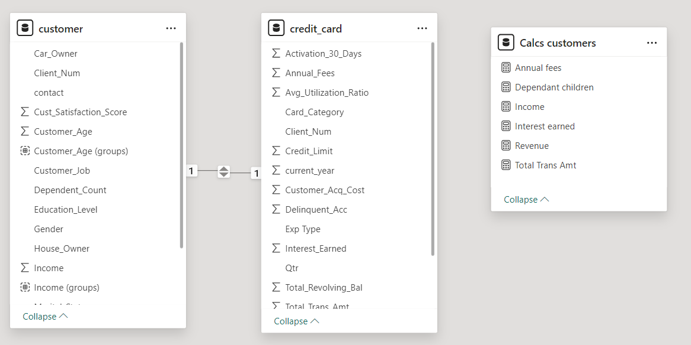
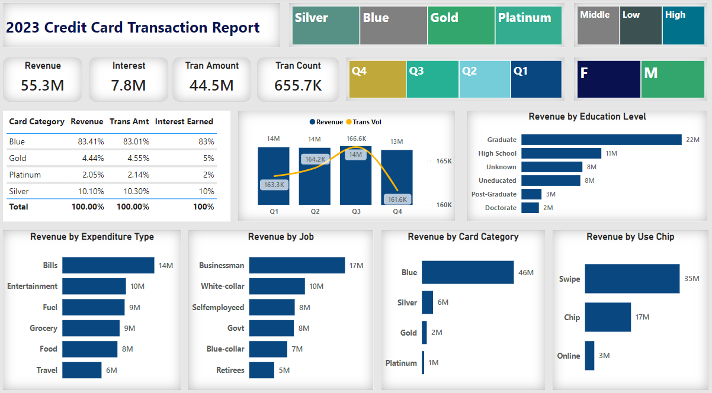
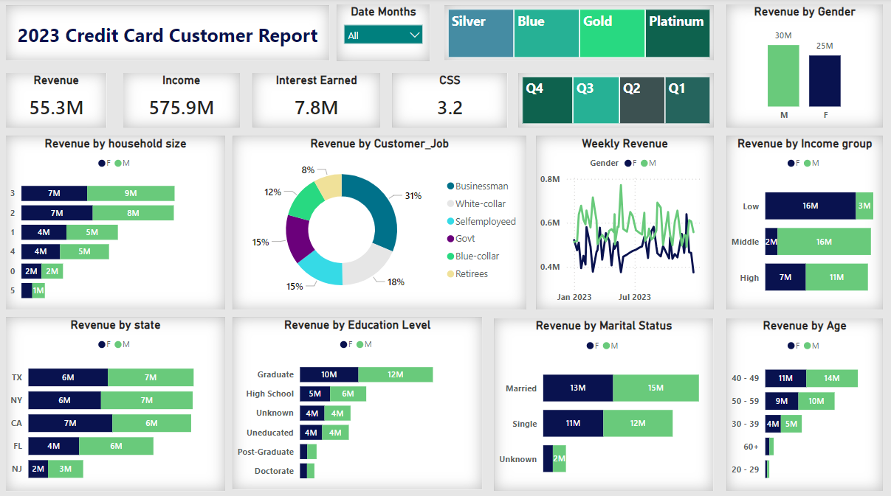

# PowerBi-Credit-Card-Analysis
---
## Introduction
This is a Power BI project on Credit Card customers and their transactions. It is designed to provide a detailed weekly analysis of credit card operations. It furnishes stakeholders with "real-time" data on essential performance indicators and trends, enhancing the capability to oversee and assess credit card activities effectively.

**_Disclaimer_**: _All datasets do not represent any company or institution but just a dataset to demonstrate the capabilities of Power BI and how we can derive insights from it_.

## Problem Statement
1. Who are our most valuable customers in terms of demographics and socio-economic status?
2. What are the most popular and profitable products and services?
3. How are customer characteristics such as education, marital status, and job type linked to credit card usage and spending behavior?
4. What are the trends and patterns in credit card usage across different times and for different transaction types?

## Skills / Concepts demonstrated
The following Power BI features were incorporated: 
- Dax
- Groups
- Modelling
- Filters
- Page navigation

## Modelling
- Adjusted the automatically derived relationships to ensure a representation of the desired relationships
- The model is a star schema with one fact table, dimension table, and 1 to 1 relationship.

**Adjusted Model**

The "calcs customers" table contains the measures I have calculated to arrive at the visualizations coming in the next step

## Visualisation

This report contains 2 pages
1. Customer Report
2. Transaction report
You can interact with the report [here](https://app.powerbi.com/groups/me/reports/2982d8c7-ca63-43ba-a145-ce89ec25e135?ctid=d61ecb3b-38b1-42d5-82c4-efb2838b925c&pbi_source=linkShare) 

**Features**
- Transaction data such as expenditure type, card category, job, chip use, revenue, and volumes
  

**Features**
- Customer data such as age, household size, job, state, education level, marital status, income group, and gender

## Analysis
**Summary**
**_Customer Demographics_**: The most valuable customers are typically businessmen, married, aged 40-49, and with higher education levels.
**_Product Performance:_** Blue card is the most used and most profitable, suggesting a focus on this segment could enhance further profitability.
**_Expenditure Patterns:_** The majority of spending occurs on bills, suggesting that these cards are used for daily financial management rather than just discretionary spending.
**_Technology Use:_** The dominance of swipe transactions over chip and online methods may indicate a market lag in adopting newer technologies or a preference for traditional methods (in-store vs online purchases) among the user base.

**Detailed Analysis**

**Revenue by Household Size**: 2 and 3-person households tend to generate more revenue.

**Revenue by Customer Job**:
- Businessmen and white-collar workers are the main revenue contributors.
- Blue-collar and government employees also contribute significantly.

**Weekly Revenue Trends**: 
- Shows seasonal or monthly trends in revenue generation, differentiated by gender.
- There are weekly fluctuations, however, every quarter, revenues are consistent throughout the year distributed at approximately 25% every quarter

**Revenue by Education Level**: Higher education levels correspond to higher revenue generation.

**Revenue by Marital Status and Age**: Married customers and those aged 40-49 are leading in revenue generation perhaps because they are more table in their careers.

**Card Category Analysis**:
- Blue cards dominate the market in revenue, transactions, and interest.
- Silver and gold cards also contribute but to a lesser extent.
- Revenue by Expenditure Type:

- Bills and entertainment are major expenditure types.
- Food and travel are significant but lesser.

**Revenue by Education Level:** Graduates are the highest contributors, significantly more than high school or post-graduate levels.

**Revenue by Card Usage:**
Most transactions are via swipe, followed by chip and online methods meaning customers are mostly purchasing in-store.

## Conclusion and recommendations

For a deeper dive into the analytics, the datasets from previous years will be required for comparison and data-driven decision-making. 
